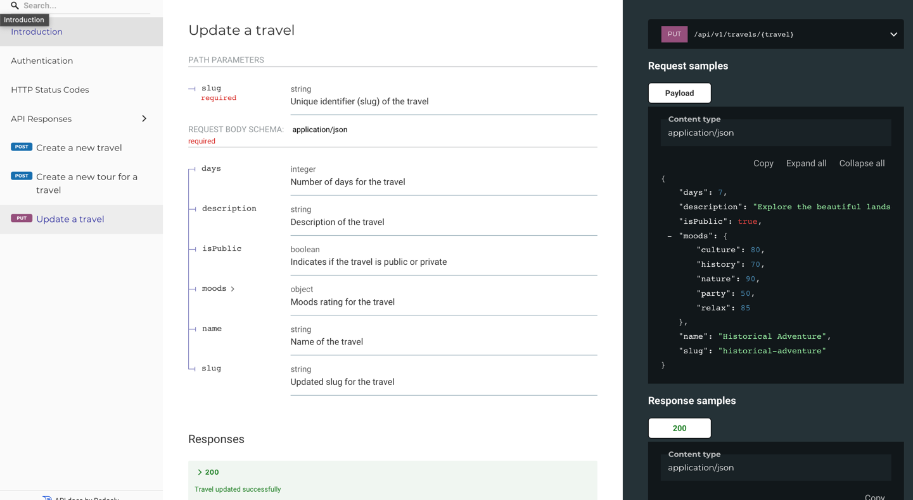

### TOOLS 
- Laravel 10.
- Laravel Pint.
- PHPstan/Larastan MAX Level.
- PHPUnit.
- Barry Laravel IdeHelper (it helps to have the models up to date with the fields and not using magic attributes and needed for Phpstan).
- MySQL

### COMMENTS AND EXPLANATIONS
- I have chosen a strategy of separating the apis in different folders and versioning. I think with this appoach is more than enough.
- I think ```is_public``` is not used in the task description.
- Ideally 'users' table should be used for _users_ and another table for ```admins```.
- This is an example of a CRUD but approaches like Hexagonal Architecture pays off in the long run.
- In the request, I like to work with type hints (a 'problem' with $request->thingy is that you don't know what type is a 'thingy').
I have used RequestServiceProvider for the sake of an example in how to extend the Framework in a clean way.
- Why not using ```Laravel Resources```? Following SRP and after my experience, every endpoint MUST have a
specific ```Request``` and a specific ```Response```. Changes in the long run will be easier to handle.
- I have used the ```Gate``` interface in the form request because it's more flexible. eg.: it gives you the opportunity to add messages.

- Docs with redocly [x]
- Tests with PHPUnit [x]
- Seeders [x]
- Policies [x]
- Service Providers [x]
- ADR approach [x]
- Value object [x]
- Laravel Pint and Larastan max level [x]
- Tours prices are handled by mutators/accesors. It can be improved with a Cast class. [x]
- Uuids for the ids [x]
- Sanctum for the auth [x]
- Private endpoint for creating a travel [x]
- Private endpoint for updating a travel [x]
- Private endpoint for create a tour in a travel [x]
- Public endpoint for listing tours in a travel [x]

### DOCS
- Inside ```docs``` folder you can find the ```changelog``` and the openapi.yaml
initial doc. Inside each endpoint folder you have the specifications (with ChatGPT or similar, you can 
generate based on the form request and response the document really fast).

- I use [redocly](https://redocly.com/) for the OpenAPI documentation. I have worked in the past with other tools, but this is the cleanest approach I know.

```shell
yarn install
yarn docs:build
yarn docs:serve
```
or
```shell
npm install
npm docs:build
npm docs:serve
```

Visit localhost:8080



### DOCKER & TESTS
Run
```shell
 docker-compose up -d
```

Then migrate the db
```shell
 docker-compose exec app php artisan migrate
```
And run the tests
```shell
 docker-compose exec app php artisan test
```
